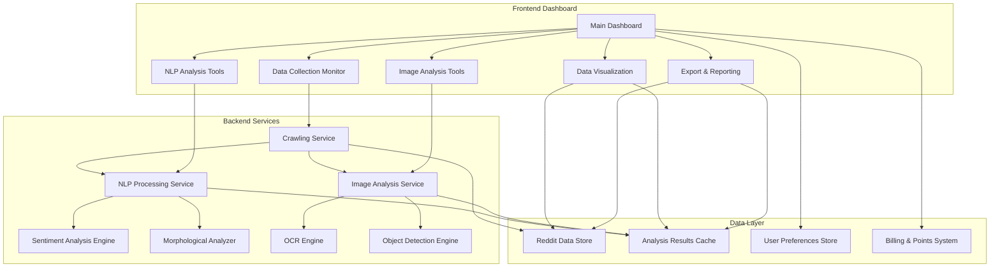

# Design Document

## Overview

The Advanced Dashboard Improvements feature transforms the existing Reddit Content Platform dashboard into a comprehensive web crawling analytics platform inspired by HashScraper's approach. The design focuses on providing real-time data collection monitoring, advanced NLP analysis tools, image processing capabilities, and intuitive data visualization - all accessible through simple click-based interactions in a professional dark-themed interface.

## Architecture

### High-Level Architecture



### Component Architecture

The dashboard will be built using a modular component architecture with the following key layers:

1. **Presentation Layer**: React components with dark theme styling
2. **State Management**: Redux/Zustand for application state
3. **API Layer**: RESTful APIs for data fetching and processing
4. **Processing Layer**: Microservices for NLP and image analysis
5. **Data Layer**: PostgreSQL for structured data, Redis for caching

## Components and Interfaces

### 1. Main Dashboard Interface

**Purpose**: Central hub displaying system overview and quick access to all features

**Key Components**:
- **System Status Cards**: Active crawling schedules, remaining points, success/failure rates
- **Quick Action Buttons**: Manual data collection triggers, analysis tools
- **Real-time Metrics**: Live collection progress, processing speed, queue status
- **Navigation Menu**: Dark-themed sidebar with organized feature sections

**Interface Design**:
```typescript
interface DashboardState {
  activeCrawlingCount: number;
  remainingPoints: number;
  successRate: number;
  realtimeMetrics: {
    collectionSpeed: number;
    queueSize: number;
    processingTime: number;
  };
  notifications: Notification[];
}

interface QuickAction {
  id: string;
  title: string;
  description: string;
  icon: string;
  action: () => Promise<void>;
  loading: boolean;
}
```

### 2. Data Collection Monitor

**Purpose**: Real-time monitoring and management of Reddit crawling operations

**Key Components**:
- **Schedule Management**: View and manage crawling schedules
- **Real-time Progress**: Live updates on collection status
- **Performance Metrics**: Speed, success rates, retry statistics
- **Manual Triggers**: One-click data collection initiation

**Interface Design**:
```typescript
interface CrawlingJob {
  id: string;
  name: string;
  status: 'running' | 'completed' | 'failed' | 'scheduled';
  progress: {
    collected: number;
    total: number;
    elapsedTime: number;
    speed: number; // items per second
  };
  pointsConsumed: number;
  retryCount: number;
  lastRun: Date;
  nextRun?: Date;
}

interface CrawlingMetrics {
  totalJobs: number;
  activeJobs: number;
  successRate: number;
  averageSpeed: number;
  pointsUsedToday: number;
}
```

### 3. NLP Analysis Tools

**Purpose**: Comprehensive natural language processing capabilities for Reddit content

**Key Components**:
- **Morphological Analysis**: Text breakdown into morphemes with POS tagging
- **Sentiment Analysis**: Emotion scoring with -1 to +1 scale
- **Text Similarity**: Fuzzy string matching for duplicate detection
- **Keyword Extraction**: Frequency analysis and word cloud generation

**Interface Design**:
```typescript
interface NLPAnalysisRequest {
  text: string;
  analysisTypes: ('morphological' | 'sentiment' | 'similarity' | 'keywords')[];
  options?: {
    language?: string;
    similarityThreshold?: number;
    keywordLimit?: number;
  };
}

interface MorphologicalResult {
  morphemes: {
    text: string;
    pos: string; // part of speech
    lemma: string;
    features: string[];
  }[];
  structure: {
    root: string;
    prefixes: string[];
    suffixes: string[];
  };
}

interface SentimentResult {
  score: number; // -1 to 1
  confidence: number;
  label: 'positive' | 'negative' | 'neutral';
  breakdown: {
    positive: number;
    negative: number;
    neutral: number;
  };
}

interface SimilarityResult {
  similarityScore: number; // 0 to 100
  matchedSegments: {
    text1: string;
    text2: string;
    similarity: number;
  }[];
}

interface KeywordResult {
  keywords: {
    word: string;
    frequency: number;
    importance: number;
  }[];
  wordCloud: {
    word: string;
    size: number;
    color: string;
  }[];
}
```

### 4. Image Analysis Tools

**Purpose**: Computer vision and OCR capabilities for visual content analysis

**Key Components**:
- **Object Detection**: Identify and label objects with confidence scores
- **OCR Processing**: Extract text from images and documents
- **Visual Classification**: Categorize image types and content
- **Batch Processing**: Handle multiple images efficiently

**Interface Design**:
```typescript
interface ImageAnalysisRequest {
  imageUrl?: string;
  imageFile?: File;
  analysisTypes: ('objects' | 'ocr' | 'classification')[];
  options?: {
    confidenceThreshold?: number;
    ocrLanguage?: string;
    maxObjects?: number;
  };
}

interface ObjectDetectionResult {
  objects: {
    label: string;
    confidence: number; // 0 to 100
    boundingBox: {
      x: number;
      y: number;
      width: number;
      height: number;
    };
    category: 'literal' | 'inferred';
  }[];
  summary: {
    totalObjects: number;
    highConfidenceObjects: number;
    categories: string[];
  };
}

interface OCRResult {
  extractedText: string;
  textBlocks: {
    text: string;
    confidence: number;
    boundingBox: {
      x: number;
      y: number;
      width: number;
      height: number;
    };
  }[];
  language: string;
  processingTime: number;
}

interface ImageClassificationResult {
  primaryCategory: string;
  categories: {
    name: string;
    confidence: number;
  }[];
  imageType: 'photo' | 'graphic' | 'text' | 'mixed';
  visualFeatures: {
    dominantColors: string[];
    brightness: number;
    contrast: number;
  };
}
```

### 5. Data Visualization Components

**Purpose**: Interactive charts and visualizations for data exploration

**Key Components**:
- **Sentiment Timeline**: Time-series charts showing sentiment trends
- **Word Frequency Charts**: Bar charts and word clouds
- **Collection Performance**: Real-time metrics dashboards
- **Comparative Analysis**: Side-by-side visualizations

**Interface Design**:
```typescript
interface ChartData {
  id: string;
  title: string;
  type: 'line' | 'bar' | 'pie' | 'wordcloud' | 'heatmap';
  data: any[];
  options: {
    responsive: boolean;
    darkTheme: boolean;
    interactive: boolean;
    exportable: boolean;
  };
}

interface SentimentTimelineData {
  timestamp: Date;
  positive: number;
  negative: number;
  neutral: number;
  volume: number;
}

interface WordFrequencyData {
  word: string;
  frequency: number;
  sentiment?: number;
  subreddit?: string;
}
```

### 6. Export and Reporting System

**Purpose**: Data export and report generation capabilities

**Key Components**:
- **Multi-format Export**: Excel, CSV, JSON, PDF support
- **Custom Reports**: Automated report generation
- **Scheduled Exports**: Recurring data exports
- **Data Filtering**: Pre-export data filtering options

**Interface Design**:
```typescript
interface ExportRequest {
  dataType: 'posts' | 'analysis' | 'images' | 'reports';
  format: 'excel' | 'csv' | 'json' | 'pdf';
  filters?: {
    dateRange?: { start: Date; end: Date };
    keywords?: string[];
    subreddits?: string[];
    sentiment?: 'positive' | 'negative' | 'neutral';
  };
  options?: {
    includeAnalysis?: boolean;
    includeImages?: boolean;
    maxRecords?: number;
  };
}

interface ExportResult {
  id: string;
  status: 'processing' | 'completed' | 'failed';
  downloadUrl?: string;
  fileSize?: number;
  recordCount?: number;
  processingTime?: number;
  expiresAt: Date;
}
```

## Data Models

### Core Data Models

```typescript
// Enhanced Reddit Post Model
interface RedditPost {
  id: string;
  title: string;
  content: string;
  author: string;
  subreddit: string;
  url: string;
  createdAt: Date;
  score: number;
  commentCount: number;
  
  // Analysis Results
  nlpAnalysis?: {
    sentiment: SentimentResult;
    morphological: MorphologicalResult;
    keywords: KeywordResult;
  };
  
  imageAnalysis?: {
    images: {
      url: string;
      objects: ObjectDetectionResult;
      ocr: OCRResult;
      classification: ImageClassificationResult;
    }[];
  };
  
  // Processing Metadata
  processingStatus: 'pending' | 'processing' | 'completed' | 'failed';
  processingTime?: number;
  pointsConsumed: number;
}

// Analysis Cache Model
interface AnalysisCache {
  id: string;
  contentHash: string;
  analysisType: string;
  result: any;
  confidence: number;
  createdAt: Date;
  expiresAt: Date;
}

// User Points and Billing
interface UserBilling {
  userId: string;
  currentPoints: number;
  totalSpent: number;
  usageHistory: {
    date: Date;
    operation: string;
    pointsUsed: number;
    description: string;
  }[];
  spendingLimits: {
    daily?: number;
    monthly?: number;
  };
}

// Crawling Schedule
interface CrawlingSchedule {
  id: string;
  name: string;
  keywords: string[];
  subreddits: string[];
  frequency: 'realtime' | 'hourly' | 'daily' | 'weekly';
  isActive: boolean;
  lastRun?: Date;
  nextRun?: Date;
  settings: {
    maxPosts: number;
    includeComments: boolean;
    enableNLP: boolean;
    enableImageAnalysis: boolean;
  };
}
```

## Error Handling

### Error Categories and Handling Strategies

1. **API Rate Limiting**: Implement exponential backoff and queue management
2. **Processing Failures**: Retry mechanisms with fallback options
3. **Data Validation**: Input sanitization and validation at all entry points
4. **Resource Exhaustion**: Graceful degradation and user notifications
5. **Network Issues**: Offline capability and sync when reconnected

```typescript
interface ErrorHandler {
  handleAPIError(error: APIError): Promise<void>;
  handleProcessingError(error: ProcessingError): Promise<void>;
  handleValidationError(error: ValidationError): void;
  handleResourceError(error: ResourceError): Promise<void>;
}

interface ErrorNotification {
  type: 'warning' | 'error' | 'info';
  message: string;
  action?: {
    label: string;
    handler: () => void;
  };
  autoHide?: boolean;
  duration?: number;
}
```

## Testing Strategy

### Testing Approach

1. **Unit Testing**: Individual component and service testing
2. **Integration Testing**: API and service integration validation
3. **Performance Testing**: Load testing for real-time features
4. **User Acceptance Testing**: Workflow validation with actual users
5. **Accessibility Testing**: WCAG compliance verification

### Key Testing Scenarios

- Real-time data collection and processing
- NLP analysis accuracy and performance
- Image processing and OCR reliability
- Export functionality across different formats
- Point-based billing accuracy
- Dashboard responsiveness under load

## Performance Considerations

### Optimization Strategies

1. **Lazy Loading**: Load analysis tools and visualizations on demand
2. **Caching**: Aggressive caching of analysis results and processed data
3. **Batch Processing**: Group similar operations for efficiency
4. **Progressive Enhancement**: Core functionality first, advanced features as enhancements
5. **Resource Management**: Efficient memory and CPU usage for real-time processing

### Scalability Design

- Microservices architecture for independent scaling
- Queue-based processing for handling traffic spikes
- CDN integration for static assets and exports
- Database optimization for large-scale data operations
- Real-time updates using WebSocket connections

## Security Considerations

### Security Measures

1. **Data Encryption**: End-to-end encryption for sensitive data
2. **Access Control**: Role-based permissions for different features
3. **Input Validation**: Comprehensive sanitization of all inputs
4. **Rate Limiting**: API and processing rate limits per user
5. **Audit Logging**: Complete audit trail of all operations

### Privacy Protection

- User data anonymization options
- GDPR compliance for data handling
- Secure data export and deletion
- Privacy-focused analytics collection
- Transparent data usage policies